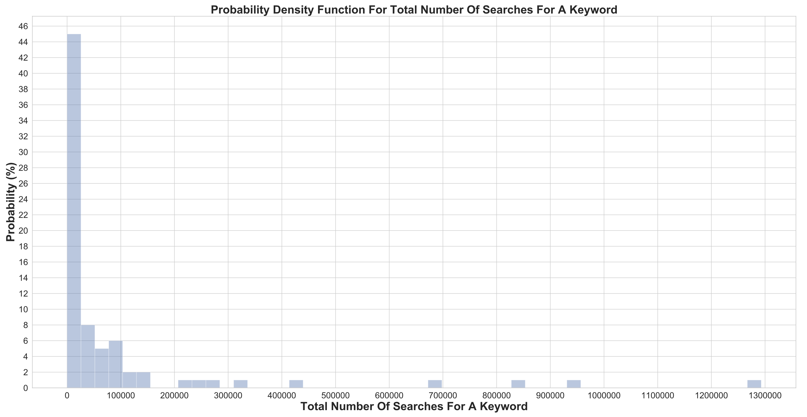
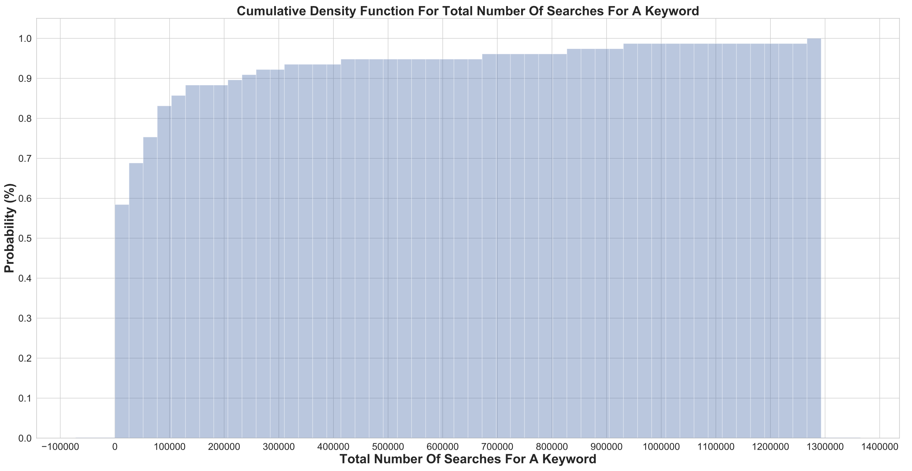
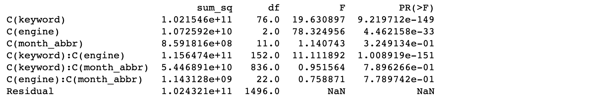

#
### Project File Summary

   - <b>[README.md](README.md)</b> - a summary of all contents in this repository.
   - <b>[data](/data)</b> - all data called from the Wordtracker API saved out as .csv files.
   - <b>[images](/images)</b> - all plots from data analysis.
   - <b>[jupyter notebook](https://github.com/alexwcheng/athleisure-advertising/tree/master/jupyter_notebook)</b> - all Jupyter Notebooks generated for this project.
   - <b>[project_prompt](/project_prompt)</b> - the prompt for this project.
   - <b>[Athleisure Ads Strategy.pdf](https://github.com/alexwcheng/athleisure-advertising/blob/master/final_presentation/Athleisure_Advertising.pdf)</b> - the final presentation for this project.
   - <b>[athleisure.csv](athleisure.csv)</b> - the final dataset for this project, extracted and merged together from the Wordtracker API.

#
### Project Members

   - <b>[Alex Cheng](https://github.com/alexwcheng)</b>
   - <b>[Justin Fleury](https://github.com/jfleury12)</b>

#
### Project Responsibilities

   -  All project responsibilities were shared equally between <b>[Alex Cheng](https://github.com/alexwcheng)</b> and <b>[Justin Fleury](https://github.com/jfleury12)</b>.

#
### Project Scenario

Our client is a startup online clothing company that specializes in "athleisure" clothing in the US. Their marketing team wants to launch an ad campaign to increase online traffic on their website, which hopefully leads to more revenue. To best allocate time and effort for the launch of the ad campaign and maximize the audience to see their ads, they want to understand 3 things. 

   - Which **keywords** related to athleisure are consumers searching for most?
   - Which **month** are consumers searching for athleisure clothing most?
   - Which **platform** are consumers using most for their searches?

#
### Project Goals:

-  Provide recommendations to the athleisure startup company to determine the best keywords, best timing, and best platform to run their ads.

#
### Data

Our data source is **[Wordtracker](https://www.wordtracker.com/)** - a paid database service for **Search Engine Optimization (SEO).** Search Engine Optimization is essentially just another way of saying: *“I want to figure out how make my website the top result for a given search.”*

Wordtracker helps clients to get more traffic to their website or better understand what consumers are searching for. Wordtracker is similar to Google Keywords Planner service, but allows access to search data on platforms beyond Google. Wordtracker offers a 1-year representative sample of search data from June 2018-May 2019 on Google, Youtube, Amazon, and Ebay. It provides over 2 billion unique keywords from 18 million global panelists, across 106 countries. Below is a synopsis of all data in the Wordtracker database related to search volume in the United States.

So for our study, we pulled data from Wordtracker with the following constraints:

- **77 terms related to athleisure, using top Amazon keyword results when searching for "athleisure".**
- **Search volumes only in the United States.**
- **Search volume data pulled from Google, YouTube, and Amazon engines.**

According to **[Search Engine Journal](https://www.searchenginejournal.com/seo-101/meet-search-engines/)** - Google, YouTube, and Amazon are the three most popular search engines worldwide. According to **[Bluelist](https://bluelist.co/blog/google-stats-and-facts/)** in 2019 there are about 2 trillion Google searches per year. Wordtracker provides nearly 2 billion Google searches within a 1 year timeframe. **We assume that Wordtracker represents a sample roughly 1/1000th of the entire Google search database worldwide.**

Below is the method of how we decided on which terms related to "athleisure" to select for our search volume queries. We searched "athleisure" on Amazon, and found all of the most frequently occuring terms in the results.

# 
### Data Collection Process

First, we used the Wordtracker API to get a general understanding of database stats for Google, Youtube, and Amazon search volume. Next, we requested search volume for each of our 77 keywords. We got search volumes by month, as well as totals for each keyword. We ended up having to painstakingly make several trial accounts in order to extract all of the data we needed. Furthermore, we had to split our API requests into 3 keywords at a time, so as not to go over the API trial-account limit for each account that we made. Finally, we coerced all API request JSONs into one concatenated DataFrame.
   
#
### Data Cleaning

For some reason, when we extracted search volume data from Wordtracker, the search volumes for the month of June for all keywords all showed as 0. We suspected this was a bug with the API or a fault in the data. Luckily, the Wordtracker API returns the total search volume for all 12 months. From this, we were able to calculate all June values and impute these values into the DataFrame.
   
#
### Exploratory Data Analysis

A Tableau dashboard was created to get a comprehensive understanding of the categorical and numerical data, all in one place. A static preview of this dashboard is displayed below. The fully interactive Tableau dashboard can be explored here: https://public.tableau.com/profile/alexander.cheng#!/vizhome/AthleisureAdvertising/AthleisureAdvertisingDashboard

A collection of wordclouds provide a non-technical, graphic sense of scale to understand the most searched athleisure terms in each search engine. The larger the keyword appears in the wordcloud, then the more that keyword was searched compared to the others. 

This lineplot shows how often athleisure keywords are searched on average over each month of the year. There seems to be a higher number of searches in the colder months than in the warmer months, with the peak being in December.

When we aggregated search volume for all of our athleisure-related keywords across all three search engines (Google + YouTube + Amazon) we noticed that the keyword **"hoodie" was the most searched term, with 1,300,000 searches.** This is followed by "sweatshirt", "running", "workout", and "flex", all with several hundred thousand searches. Across all 77 keywords that were considered, the **average number of searches is about 100,000.**

In observing metrics on each search engine, we found that Amazon and YouTube have a very low total search volume compared to Google. In the barplot on the left, we can see that Google has nearly 600,000,000 total searches, while Amazon and YouTube combined are less than 100,000,000. However, in the barplot on the right, we can see the search ratio for athleisure-related terms, compared to all searches on each search engine. So even though Amazon has the lowest overall search volume, it has by far the highest ratio for athleisure-related terms. **Over 25% of all searches on Amazon are related to athleisure keywords!** In comparison, 5% of searches on YouTube are related to athleisure keywords. And less than 1% of searches on Google are related to athleisure keywords. **These findings suggest that Amazon and Youtube may be better places to run ads rather than Google, since people are clearly searching athleisure keywords more often on those platforms.**

The Probability Density Function plot below shows that a pretty good chunk of our keywords have a small search volume - close to zero compared to the rest of our keywords. Clearly, some keywords are searched much higher than others, and highly searched keywords are rare.

The Cumulative Density Function plot below shows that 90% of our keywords have a search volume that is less than 200,000. Once again, this obviates that a large amount of our keywords have a low search volume, and that there are only a handful of highly searched keywords. This CDF plot is logarithmic in nature.

#
### Statistical Testing

**Alpha Value**

- **If alpha < 0.05, then we reject the null hypothesis.**
- **If alpha >= 0.05, then we fail to reject the null hypothesis.**
- This alpha value is not too lenient, nor is it too strict.
- Alpha values typically range between 0.01, and 0.1.

**ANOVA**
- One-Way Analysis Of Variance (ANOVA) was our statistical test of choice, since we are dealing with multiple groups.
- Two-Way ANOVA was also used later on to determine which combinations of factors were statistically significant.
- Three-Way ANOVA was attempted, but was unable to run due to lack of processing power.

**Tukey Test**
- The problem with ANOVA, is that it only compares the means between groups and determines if any of those means are statistically significantly different from each other.
- In other words, ANOVA tells us if our results or significant or not, but does not tell us **where** the results are significant.
- Interpretability of statistical significance is crucial to communicate to our client. We have to be able to tell them which keywords perform best, which search engine is best, or which month is best to run ads!
- So, the Tukey Test allows us to interpret the statistical significance of our ANOVA test and find out which **specific** groups’s means (compared with each other) are different.
- So, after performing each round of ANOVA, we followed up with a Tukey Test to find out where the statistical significance was occuring in our data.

#
### Hypothesis Test 1: Keywords

**Are there any differences between athleisure-related keywords when considering search volume?**
- H01 - All athleisure-related keywords are equal in terms of average search volume.
- HA1 - Some athleisure-related keywords have greater average search volumes than others.

**One-Way ANOVA Result:**
- P-Value = 1.3293563590514185e-119 < 0.05 (This is nearly zero.)
- We reject the null hypothesis that mean search volume is equal across all athleisure-related keywords.
- Keyword on its own, does indeed constitute a difference in average search volume for athleisure-related items.

**Tukey Test Result:**
- Top 5 terms that are the "most" statistically different than the rest are:
   - "hoodie"
   - "running"
   - "sweatshirt"
   - "workout"
   - "flex"
   

#
### Hypothesis Test 2: Months

**Are there any differences between months when considering search volume?**
- H02 - People will be equally likely to search for activewear-related terms in any given month.
- HA2- People will be more likely to search for activewear-related terms depending on the month.

**One-Way ANOVA Result:**
- P-Value = 0.8831258135517717 > 0.05
- We fail to reject the null hypothesis that mean search volume is equal across all months.
- The month on its own, does not constitute a difference in search volumes for athleisure-related items.

**Tukey Test Result:**
- No need to run Tukey multiple comparisons test since we failed to reject the null hypothesis here.

#
### Hypothesis Test 3: Search Engine

**Are there any differences among search engines when considering search volumes?**
- H03 - There will be an equal search volume for activewear-related terms on any platform.
- HA3 - There will be a greater search volume for activewear-related terms on one particular platform.
   
**One-Way ANOVA Result:**
- P-Value = 7.19196465389629e-18 < 0.05 (This is nearly zero.) 
- We reject the null hypothesis that mean search volume is equal across all search engines.
- Search engine on its own, does indeed constitute a difference in average search volume for athleisure-related items.

**Tukey Test Result:**
- In all cases, reject the null hypothesis that search engine 1 is equal to search engine 2 in terms of average search volume.
- Search volumes are unique to each platform.

#
### Multiple ANOVA + Tukey Test

Unfortunately, a full-fledged three-factor ANOVA between keywords, month, and search engine could not be run due to lack of processing power. However, two-factor ANOVA was run between all three factors to see if any two combinations of these factors was statistically significant. We essentially wanted to answer this question: **"Can we determine which specific 2-factor combinations of keyword/month/search engine generate the highest search volume?"**

**Hypothesis Test 1: Keyword + Engine**
- H01 - All keyword/engine combinations are equal in terms of mean search volume.
- HA1 - Some keyword/engine combinations have greater mean search volume.

**Two-Way ANOVA Result:**
- P-Value = 1.008919e-151 < 0.05 (This is nearly zero.)
- Reject the null hypothesis that the mean search volume is equal among all Keyword/Engine combinations.

**Hypothesis Test 2: Keyword + Month**
- H02 - All keyword/month combinations are equal in terms of mean search volume.
- HA2 - Some keyword/month combinations have greater mean search volume.

**Two-Way ANOVA Result:**
- P-Value = 7.896266e-01 > 0.05
- Fail to reject the null hypothesis that the mean search volume is equal among Keyword/Month combinations.

**Hypothesis Test 3: Engine + Month**
- H03 - All engine/month combinations are equal in terms of mean search volume.
- HA3 - Some engine/month combinations have greater mean search volume.

**Two-Way ANOVA Result:**
- P-Value = 7.789742e-01 > 0.05
- Fail to reject the null hypothesis that the mean search volume is equal among Engine/Month combinations.

**Conclusion**
- Keyword/Engine combinations mean search volumes are statistically different from each other
- Keyword/Month and Engine/Month are not statistically different from each other.

**Tukey Test Result:**
- There were 10 Keyword/Engine combinations that were significantly different in search volume.
- These 10 unique combinations will be our recommendations to our client.
   - "running" / youtube
   - "hoodie" / youtube
   - "sweatshirt" / youtube
   - "workout" / amazon
   - "flex" / youtube
   - "hoodie" / amazon
   - "leggings" / amazon
   - "workout" / youtube
   - "joggers" / amazon
   - "cotton" / youtube

#
### Conclusions

**Keywords:**

- There were 5 keywords that outperform any other athleisure-related keyword tested across all platforms and months.
- We recommend that the ad campaign use these 5 buzzwords:
   - "hoodie"
   - "running"
   - "sweatshirt"
   - "workout"
   - "flex"

**Platform**

- Ads should **not be launched on Google,** because it has the lowest search volume for athleisure-related keywords.
- If **search volume** is most important, then we recommend **YouTube.**
- If **market share** is most important, then we recommend **Amazon.**

**Month**

- The month by itself is not a statistically significant enough of a factor to provide a confident recommendation. 
- Month should only be considered as a factor when combined with a particular platform and set of keywords. 

**Below are the top 10 keyword / platform combinations that we would recommend to our athleisure clothing startup company to help them guide their advertising efforts online. Note that Google is not recommended as a platform to run athleisure advertisements.**

#
### Improvements + Future Work

**Improvements**

- Ensure all word types being tested are similar.
   - For example, use all nouns, or all adjectives, etc…
- Limit results to clothing-related searches.
   - For example, consider pairing an “athleisure” related adjective to an article of clothing - ex: “breathable hoodie”, “ventilated shorts”, “striped joggers”, etc…
- Ensure all platforms being compared are the same in the service that they provide for better accuracy.
   - For example, compare Google to Bing, or YouTube and Vimeo, or Amazon and Ebay.

**Future Work**

- Explore search volume demographic statistics of each engine.
   - For example: age, gender, or income.
- Investigate "conversion rates".
   - Meaning: who actually buys the product after viewing the ad?
- Consider the costs of running an ad on a particular platform. 
   - For example, what is the cost of an ad on Google versus Amazon?
